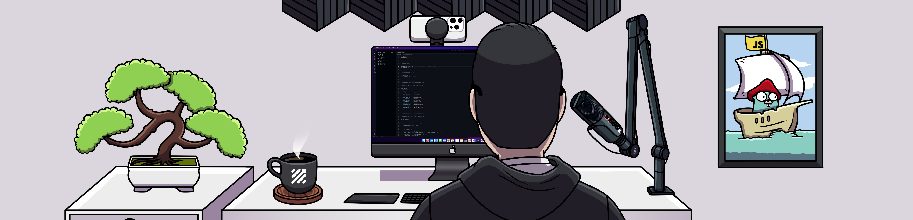

<h1>
  <picture>
    <source media="(prefers-color-scheme: dark)" srcset="dark-banner.png">
    <source media="(prefers-color-scheme: light)" srcset="light-banner.png">
    
  </picture>
</h1>

Hi, I'm Nathan 👋 When I'm not working on my own projects, I'm usually helping others with theirs. I'm currently focused on my podcast startup, The Take, a series of micro episodes about tech. Check it out below!

### O(N): The Take – A LinkedIn-exclusive podcast

- 🔥 [Never Push to Prod on Friday!](https://www.linkedin.com/feed/update/urn:li:activity:7080639315600412672)
- 🔮 [Future-Thinking Leads](https://www.linkedin.com/feed/update/urn:li:activity:7083833539397341185)
- 🙈 [Looks Good to Me!](https://www.linkedin.com/feed/update/urn:li:activity:7091467927975051264)